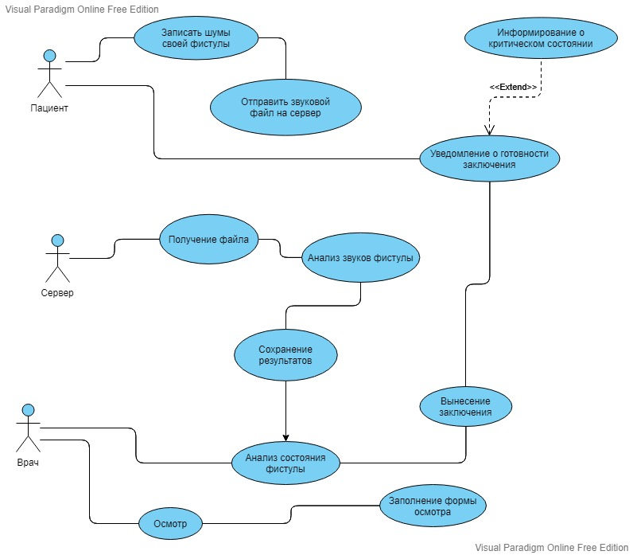
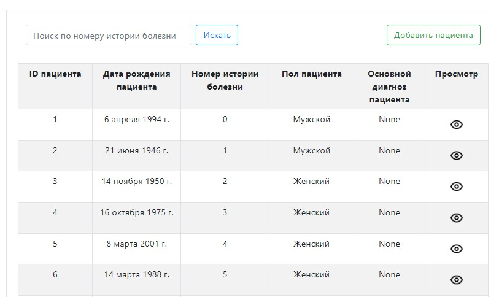
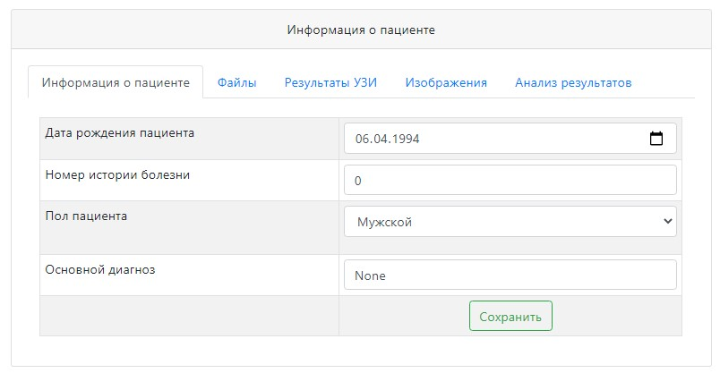
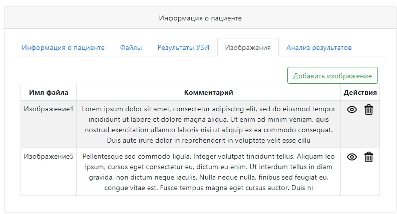
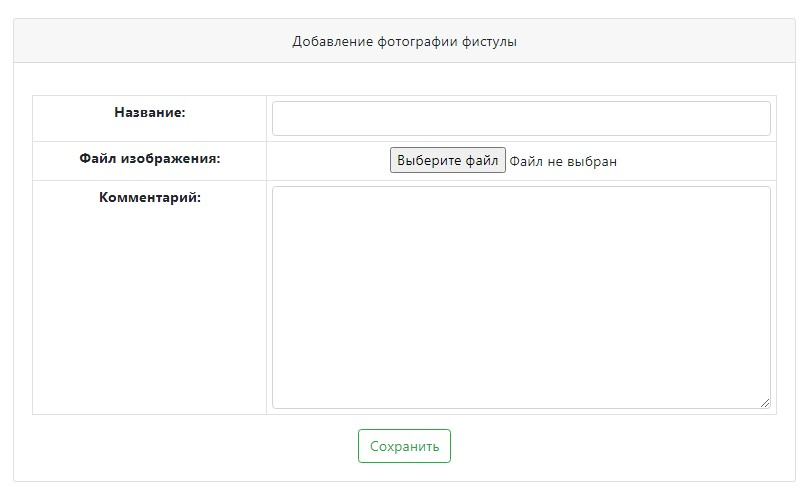
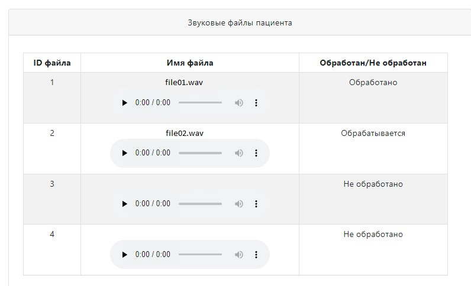

# Репозиторий с документами

## [Видение](docs/Vision.md)

## [Спецификация прецедента](docs/Use-Spec.md)

---

## Use-case диаграмма (или что-то на неё похожее)

## Попытки в модель предметной области (МПО)

## Примеры пользовательского интерфейса (UI)

