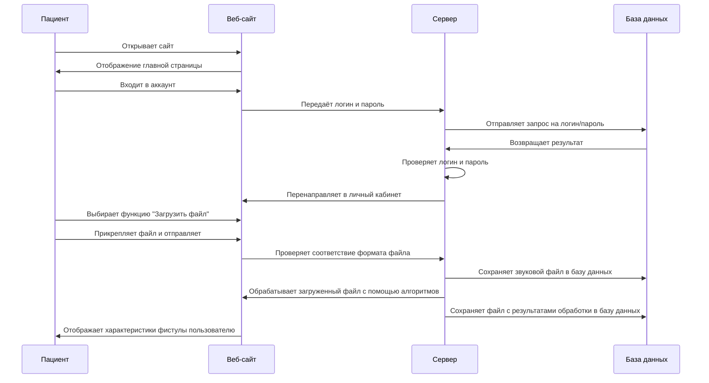
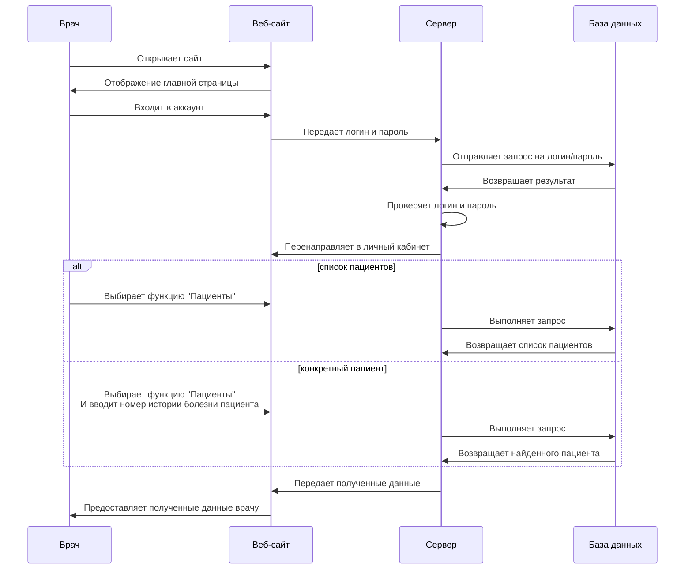
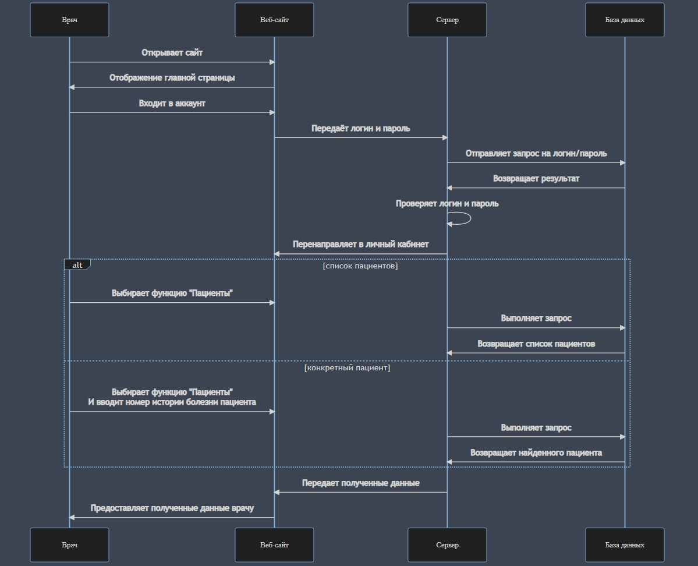

# Спецификация прецедента

## Предусловия

Пользователь (пациент или врач) выполнил вход в аккаунт;

Пациент записал звук фистулы.

## Постусловия

Звуковые файлы с шумами фистулы сохранены;

Результаты обработки загруженных файлов сохранены;

Характеристики фистулы показаны пациенту;

Список пациентов врача получен и показан пользователю.

## Загрузка и обработка звукового файла с шумами фистулы

### Текстовое описание

- Пациент открывает сайт;
- Сайт загружает стартовую страницу;
- Пользователь авторизуется на сайте;
- Сайт отпраляет логин и пароль на сервер;
- Сервер обращается к базе данных;
- В базе данных выполняется запрос и результат возвращается на сервер;
- Сервер проверяет соответствие логина и пароля;
- При успешной авторизации загружается личный кабинет;
- Пациент выбирает функцию загрузки звуковых файлов;
- Пациент выбирает звуковые файлы на устройстве и прикрепляет их во вложении;
- Файлы загружаются на сервер и проверяются на соответствие формату wav;
- Сервер сохраняет звуковые файлы в базу данных;
- Сервер обрабатывает звуковые файлы и записывает характеристики фистулы пациента;
- Файл с результатами сохраняется в БД;
- Результат обработки отображается у пациента;

### Диаграмма последовательностей

---

## Получение списка пациентов одного врача

### Текстовое описание

- Врач открывает сайт;
- Сайт загружает стартовую страницу;
- Пользователь авторизуется на сайте;
- Сайт отпраляет логин и пароль на сервер;
- Сервер обращается к базе данных;
- В базе данных выполняется запрос и результат возвращается на сервер;
- Сервер проверяет соответствие логина и пароля;
- При успешной авторизации загружается личный кабинет;
- Врач переходит на вкладку "Пациенты";
- Сервер обращается к базе данных;
- В ответ возвращается список всех пациентов авторизованного врача;
- Врач вводит номер истории болезни;
- Сервер обращается к базе данных и передает введенный параметр;
- База данных выполняет SQL запрос и возвращает результат;
- Полученный список пациентов либо информация по конкретному пациенту отображается врачу;

### Диаграмма последовательностей

